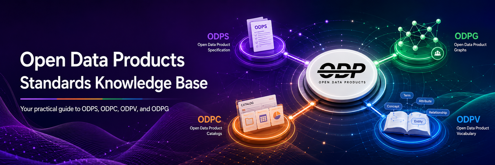

  

<h1 align="center">Open Data Product Standards Knowledge Base</h1>

  A practical knowledge space for the <strong>OpenDataProducts.org standards family</strong>, including ODPS, ODPC, ODPV, and future ODPG guidance.

  
  
  
  
  
  
  

  <a href="#faq-with-examples"><strong>Browse FAQ</strong></a>
  ·
  <a href="faq/yaml"><strong>View YAML examples</strong></a>
  ·
  <a href="#tools-and-resources"><strong>Use tools and resources</strong></a>
  ·
  <a href="#udemy-masterclasses"><strong>See training</strong></a>

## What is in this repo?

<table>
  <tr>
    <td align="center" width="20%"><h2>34</h2></td>
    <td align="center" width="20%"><h2>14</h2></td>
    <td align="center" width="20%"><h2>2</h2></td>
    <td align="center" width="20%"><h2>3</h2></td>
    <td align="center" width="20%"><h2>4</h2></td>
  </tr>
  <tr>
    <td align="center"><strong><code>faq/</code></strong> Practical Q&A pages for ODPS, ODPC, ODPV, and future ODPG guidance.</td>
    <td align="center"><strong><code>faq/yaml/</code></strong> Companion YAML examples for specs, catalogs, vocabulary, contracts, pricing, access, SLA, and DQ.</td>
    <td align="center"><strong><code>ODPS4/</code></strong> Sample Open Data Product YAML files for schema and product patterns.</td>
    <td align="center"><strong><code>resources/</code></strong> Toolkit, visual, whitepaper, and supporting download files.</td>
    <td align="center"><strong><a href="#udemy-masterclasses">Training Courses</a></strong> Udemy MasterClasses for ODPS, monetization, product mindset, and governance.</td>
  </tr>
</table>

## Why use it?

- Learn through applied examples rather than specification text alone.
- Reuse proven YAML patterns across product specs, catalogs, vocabulary, and governance.
- Find production-ready references for real data product work.
- Combine FAQs, templates, Python tools, training, and AI assistance in one place.

---

## FAQ with examples

This section helps you understand and apply the OpenDataProducts.org standards family through practical, modular examples. The FAQs are grouped by specification so you can start with the standard you are using.

- explanation of the concept
- plain YAML snippets
- companion YAML examples in `faq/yaml`

### 🟣 ODPS: Open Data Product Specification

Use these when you are defining one data product and its metadata, contract, pricing, access, quality, and validation rules.

**Core concepts**

- [What is ODPS, and why should I use it?](faq/what-is-odps.md)
- [What does a complete ODPS-compliant product look like?](faq/full-example.md)
- [What are the required and optional sections in ODPS?](faq/required-optional.md)
- [How do I define metadata for my data product?](faq/define-metadata.md)
- [How do I define related products and use cases?](faq/define-related.md)

**Strategy and business value**

- [How do I define a product strategy and what is it?](faq/productstrategy.md)
- [How do I define product internal KPIs to measure product?](faq/productKPIs.md)

**Contract and licensing**

- [How do I define a contract for my data product?](faq/contract.md)
- [How do I declare a license using ODPS?](faq/license.md)

**Pricing, access, and service levels**

- [How do I define pricing plans?](faq/pricing.md)
- [Can I offer free and paid tiers in the same product?](faq/mixed-tiers.md)
- [How do I assign SLAs to pricing plans?](faq/sla-linking.md)
- [How do I define and reuse a payment gateway?](faq/payment-gateways.md)

**Reuse, quality, and validation**

- [How do I reuse SLA, DQ, and Access across products?](faq/reuse-components.md)
- [Can I reference external YAML files?](faq/external-ref.md)
- [What’s the difference between internal and external references?](faq/internal-vs-external-ref.md)
- [How do I define data quality rules?](faq/data-quality.md)
- [How do I specify access roles or visibility rules?](faq/access-control.md)
- [How do I validate an ODPS spec in tools?](faq/validate.md)
- [How do I validate an ODPS YAML file?](faq/validation.md)
- [Are there templates I can use to start faster?](faq/templates.md)

### 🟠 ODPC Catalogs and Portfolio Management

Use these when you are cataloging a portfolio of data products, use cases, business objectives, signals, and product references.

- [What is ODPC, and why should I use it?](faq/what-is-odpc.md)
- [What is the difference between ODPC, ODPS, and ODPG?](faq/odpc-vs-odps.md)
- [What does a simple ODPC catalog look like?](faq/odpc-catalog-example.md)
- [How do I use ProductReference in ODPC?](faq/odpc-product-reference.md)
- [What Python tools are available for ODPC?](faq/odpc-python-tools.md)

### 🔵 ODPV Vocabulary and Shared Terms

Use these when you need controlled vocabulary terms for data product objects, value concepts, governance concepts, and graph relationship names.

- [What is ODPV, and why should I use it?](faq/what-is-odpv.md)
- [How does ODPV relate to ODPS, ODPC, and ODPG?](faq/odpv-standards-family.md)
- [What are the main ODPV vocabulary groups?](faq/odpv-vocabulary-groups.md)
- [How do I use ODPV relationship terms?](faq/odpv-relationship-terms.md)
- [What Python tools are available for ODPV?](faq/odpv-python-tools.md)

### 🟢 ODPG: Open Data Product Graphs

FAQ entries will be added here next for connecting data products, catalogs, use cases, objectives, KPIs, signals, governance objects, providers, and consumers.

### 🤖 Cross-standard AI and Automation

- [How does ODPS support AI agent consumption?](faq/ai-agent-consumption.md)
- [How to use ODPS spec with LLMs.txt?](faq/odps-llms-txt.md)
- [How to build AI-assisted Minimum Lovable Governance with Claude?](https://github.com/Data-Maestro-Academy/DIY-MLG)

> Each FAQ answer is stored in `/faq`, and most include a matching YAML example in `faq/yaml`.

---

## 6 Tools, Libraries, and Downloads

Use these when you want to move from reading the standards to validating files, generating artifacts, designing products, or implementing with Python.

**Specification tools**

- **ODPC Python tools**: validate catalog files, summarize catalogs, search catalog object guidance, and keep generated catalog artifacts in sync. See [ODPC scripts](https://github.com/Open-Data-Product-Initiative/odpc-v1.0/tree/main/scripts) and [ODPC Python tools FAQ](faq/odpc-python-tools.md).
- **ODPV Python tools**: validate vocabulary files, regenerate derived vocabulary artifacts, and search controlled vocabulary terms. See [ODPV scripts](https://github.com/Open-Data-Product-Initiative/odpv-v1.0/tree/main/scripts) and [ODPV Python tools FAQ](faq/odpv-python-tools.md).
- **YAML Builder for Open Data Products**: AI-assisted authoring and validation for ODPS 4.0 YAML, with schema-aware guidance for contracts, access, pricing, SLA, DQ, `$ref`, and modular YAML structures. [Open ODPS GPT in OpenAI](https://chatgpt.com/g/g-687a26b92c20819182e92a8641fbd02f-yaml-builder-for-open-data-products).

**Downloads and libraries**

- **Data Product Toolkit**: free canvases for designing, measuring, and managing data products, including Data Product Canvas 2.1, Value Measure Framework, and Blueprint Model. [Download the toolkit](./resources/Data_Product_Toolkit.pdf).
- **Minimum Lovable Governance Whitepaper**: governance and operating model guidance for data product teams. [Read the whitepaper](https://github.com/Open-Data-Product-Initiative/odps-knowledge-base/blob/main/resources/Minimum%20Lovable%20Governance%20for%20Data%20Products%20Whitepaper.pdf).
- **ODPS Python Library**: a Python library for creating, validating, and manipulating ODPS v4.0 documents. [Get the library](https://github.com/Accenture/odps-python).

---

## 4 Training Courses

Apply Open Data Product standards and data product practices with structured Udemy MasterClasses on ODPS, monetization, governance, AI readiness, and product strategy.

- **[Master the Leading Data Product Specification with GPT tool](https://www.udemy.com/course/master-the-open-data-product-specification-with-gpt-tool/?referralCode=7602F38C9E58976291A3)**
  A focused introduction to ODPS for architects, business managers, and product owners.

- **[Data Product Monetization MasterClass](https://www.udemy.com/course/data-product-monetization-masterclass/?referralCode=53941B985FBFA582CBC7)**
  Learn how to turn ODPS-based products into revenue-generating offerings, including pricing, AI monetization, and payment strategy.

- **[Data Product MasterClass](https://www.udemy.com/course/data-product-mindset/?referralCode=548AA9F02E100D61D284)**
  Build a practical data product mindset with blueprints, examples, and execution guidance.

- **[Minimum Lovable Governance](https://www.udemy.com/course/data-products-minimum-lovable-governance-masterclass/?referralCode=3A5188B67577CFBC0B18)**
  Learn governance patterns that fit lean teams and support scalable data product delivery.

> These courses are designed to complement the documentation and examples in this repository.

## Need help?

If you cannot find what you are looking for, please [raise an issue](https://github.com/Open-Data-Product-Initiative/odps-examples/issues) and describe your need.
